```{r, include = FALSE}
knitr::opts_chunk$set(
  collapse = TRUE,
  comment = "#>"
)
```

# Introduction

This R project is design to automate the download process of MS2Soft traffic counts by using RSelenium as the main engine to scrape the pages. The program allows to get permanent traffic counts, short term stations, classification traffic counts and speed data (in process). 

The program requires a simple preparation process to setup two input files that will allow for the code to work adequately. Once the preparation is done, the input files are imported into the code and the process is composed of two parts: data download and database conformation. The process structure is as follows:

1. Preparation
    1. Define Project Needs
    2. Determine Analysis Type
    3. Determine URL properties (if needed)
    4. For class analysis, define reclassification
    5. Prepare input file
    6. Determine stations for analysis
    7. Prepare stations list
2. Prerequisites
    1. Install Java JDK
    2. Install Mozilla Firefox
    3. Copy Folders
    4. Install R Packages

# Preparation

This section describes how to prepare the data and inputs required for the R script to work, in terms of the type of analysis to be performed, as well as the selection of stations in accordance to the project's needs and requisites. The process benefits from having a certain folder structure and to follow a set of key steps to operate correctly, starting with preparing the input files which are in MS Excel format. The main page of the input file is shown in the following image, its contents will be explained in the next sections. Advanced users can avoid creating the input and stations file by filling the information within R, which is not really recommended or recommended only for quick analyses.

<center>
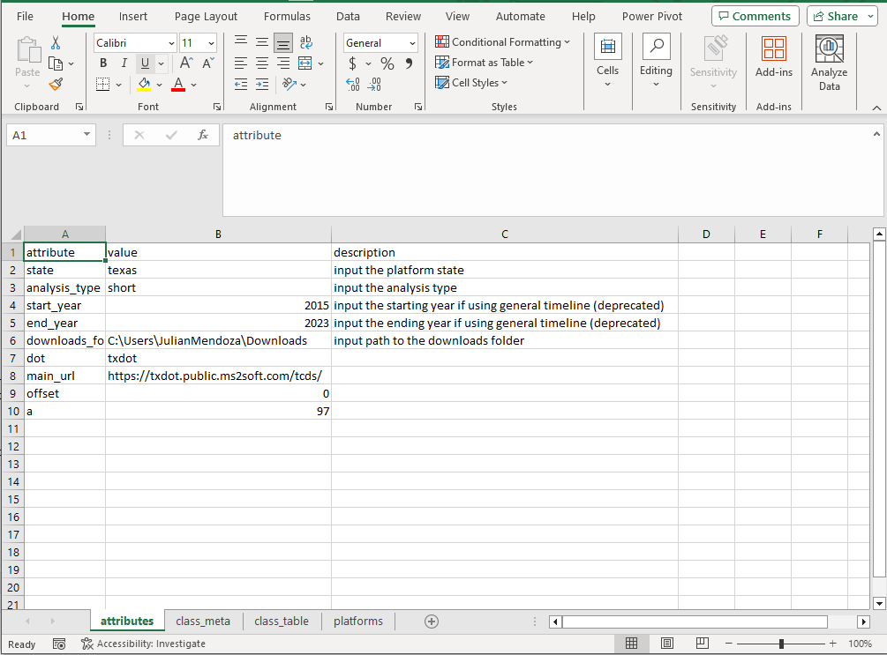{width=80%}
</center>
<br>

**1. Define Project Needs**

The main needs of the project do not impact how this process works, but are important in order to make decisions about what kind of stations should be selected and during which time frame. Most projects would need data before, during and after COVID-19, as well as certain stations depending on the type of project. The main focus of the preparation stage is to prepare both input files, one that contains the attributes needed for the analysis, and one containing the list of stations and their characteristics. 

**2. Determine Analysis Type**

All analysis types can be performed over the same set of stations, given that these types of data are available. The `ms2_data` function performs a different algorithm for permanent stations, short term stations, and stations with classification data, which can be permanent or short term. Speed data is planned but not developed yet. This conforms the analysis types needed for the functions to operate. The selection of stations should consider which analysis type is being done because not all stations contain all data types, the next image shows an example of a station containing all types of data.

<center>
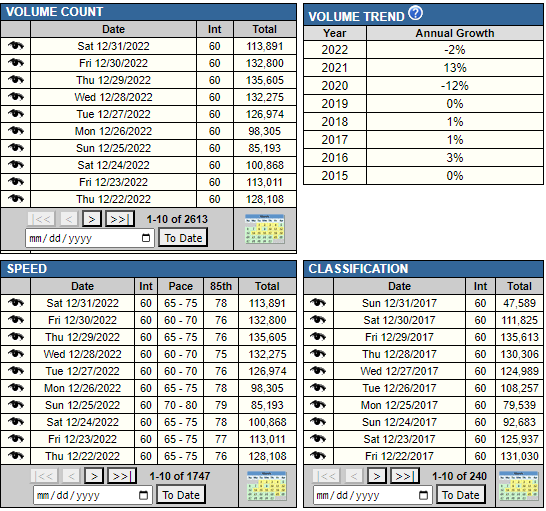
</center>
<br>

If a classification analysis will be performed, additional steps should be considered and will be explained later.

**3. Determine URL properties**

There are three main properties that compose MS2Soft URLs: the state platform, the "offset" and the "a" parameter. The state platform determines the first part of the URL, usually referring to the Department of Transportation of the State hosting the platform. The other two parameters complete the URL and serve as identifiers. These parameters remain constant for each State so a database is continuously maintained with this information. Please contact the authors to update the input file with the parameters as needed. The platforms tab within the input file contains a list of platforms from States where work has been performed in the past. To add a platform, users simply should add the parameters into the platforms tab, the parameters can be found in any URL related to the platform by using Mozilla Firefox to open a frame (more on this in the prerequisites section).

<center>
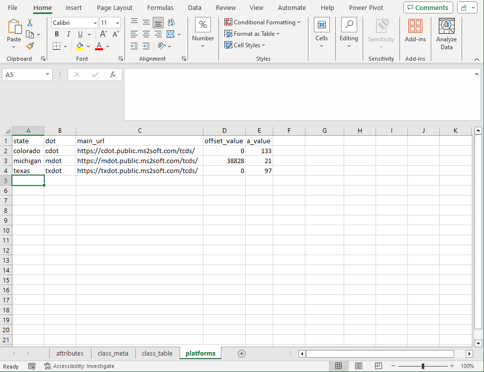{width=80%}
</center>
<br>

**4. Define re-classification (for class analysis)**

Classification data can be used with its original classification, but the process allows to apply custom classifications allowing for simpler variable names, depending on the project's needs. Up to three re-classifications can be defined within the code via the "class_number" argument which defaults to **1**, so the default re-classification should be filled within the Class1 column of this tab. To "group" classes, it is recommended to use different names as shown in the "Class3" column, with sequential IDs that can be removed later. These codes will be used as column names for the classification data tables that will be downloaded, and some software cannot handle identical column names.

<center>
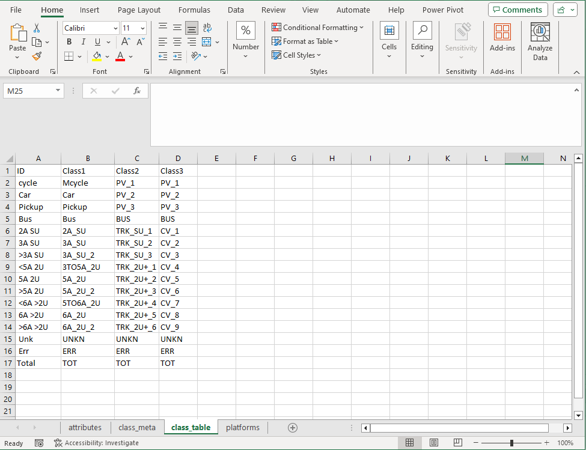{width=80%}
</center>
<br>

**5. Prepare Input File**

Once the previous steps have been completed and all parameters are filled into the tabs, there are some final details to be reviewed and prepared within the input file. The program reads the attributes tab and the class_table tab (when applicable). 
The first attribute contains the State, once the platform tab has been filled with the correct information, the State is looked up within this table to extract the Department of Transportation (dot), conform the main URL and get the "offset" and "a" parameters. The analysis type is also selected with a drop down menu, as mentioned before, to perform multiple analysis types the user must do one at a time.
In addition, the program uses the system's downloads folder to pivot downloaded files, in other words, all data is downloaded into this folder and then copied into the correct folder within the project's directory. This parameter should also be checked from within the computer's File Explorer. Chances are that the only requirement would be to change the user within the path that comes with the input file. For the example shown, replace "JulianMendoza" with your user's name.

**6. Determnine stations for analysis**

Determining the stations for analysis is very important and should be done before any code is run. Stations show a summary of the data available (as shown before) so they can be pre-selected depending on the data they contain, the dates available and their location. To view the station details, click in the "View Detail in a New Search" link when selecting a station. 

<center>
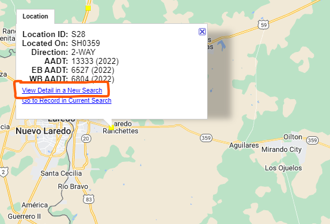{width=50%}
</center>
<br>

The information shown in the main frames of the stations shows the corresponding category, this is especially important when selecting permanent stations. In addition, the station data section contains the available tables, as shown before, for volume and classification data. Empty tables mean no data is available for that category.

<center>
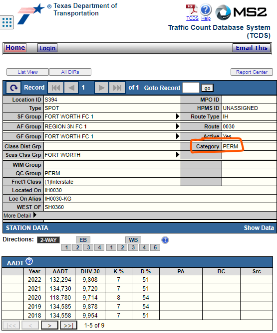
</center>
<br>

Regarding the dates, it might be practical to research briefly about how many days each year are available but not necessary as the `ms2_all_dates`function gets all dates available. On the other hand, it is important to know the available years and register them in the stations list, this will allow to save time avoiding unnecessary requests for years where information is not available. The years available for each station are shown in the main frame of each station when selected.

<center>
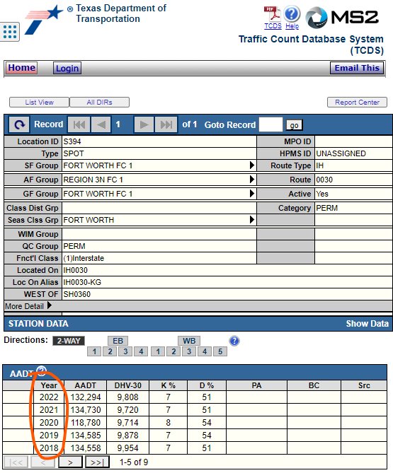
</center>
<br>

Finally, stations' geographical locations can be downloaded by clicking the "List view" button, most states allow to perform a search by location ID, but this is not to be assumed. It might be convenient to download a list of stations by filtering counties and communities. The downloaded list will contain many stations that should be filtered with GIS software based on the previous criteria. In addition, many attributes from this list will be used to fill the "stations_list" Excel input file.

<center>
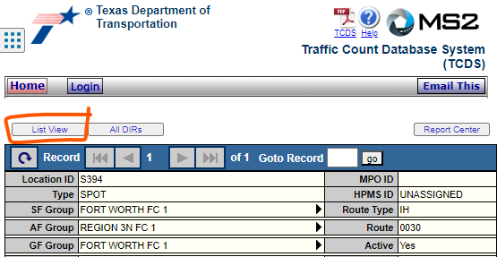
</center>
<br>

**7. Prepare Stations List**

The stations list input file should contain the basic information about the stations for which data will be downloaded, including metadata obtained directly from the MS2Soft platform and some additional information. 
The first columns can all be extracted from the list obtained directly from the platform, Loc_ID contains the station code, followed by the County, Community and Functional Class. These can also be used to filtered station in the previous steps. Next, the Rural_Urban column is self-explanatory, the ON column refers to the road where the station is located. Next come the coordinates columns followed by the Latest_Date column which contains the most recent date where data is available for that station.

The next set of columns are user generated. First, start_year and end_year define the period for which data will be downloaded. This is set individually by station to avoid wasting resources in getting years that might exist for one station but not for another.
The next column contains the type of analysis to perform for the corresponding station. The recommended approach when performing multiple analysis for the same stations (i.e. permanent and classification), is to repeat the record for that station with different types, as shown in the example below.
The bridge vicinity column is not used at the moment so it can be left empty, it purpose is to be able to relate the stations traffic profiles to the border crossings of the bridge in closest vicinity.
Finally, the dir_id column show contain both directions available for the station as presented in the MS2Soft platform, the code uses this column to separate each direction and concatenate the URL where data is stored. 

**Important note on direction IDs**
Two special cases have been identified regarding how directions are reported in the MS2Soft platform. The first case consists on stations located on 1-way roads, which does not produce a typical URL. The second case occurrs in stations that are 2-way, but do not report traffic by direction. For these two cases, the *direction_id* variable should be filled with **aggr** (for aggregated). This will allow the functions to not expect a pair of directions and to look for the data in the main page of the given station.

<center>
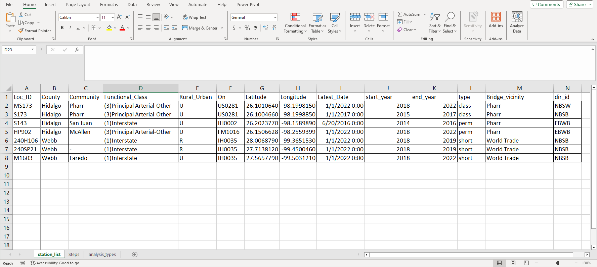{width=100%}
</center>
<br>

# Prerequisites

This section shows the prerequisites needed to run the program. Additional software should be installed to ensure the correct functionality and folders must be set up in an specific way so that all internal paths are correctly referenced. In addition, some R packages must be installed.

**1. Install Java JDK**

The first prerequisite is to have Java Development Kit (JDK) installed. For simplicity and generalization, do a Google search for Java JDK and get the latest version according to the user's operating system. At the time of writing this document, the site looks like the following picture.

<center>
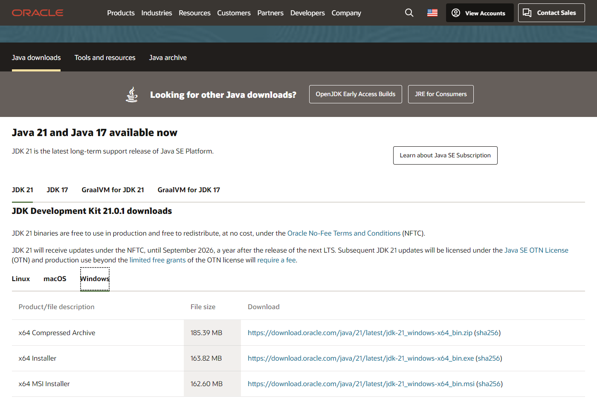{width=80%}
</center>
<br>

System must be restarted after installing Java Development Kit.

**2. Install Mozilla Firefox**

Mozilla Firefox allows for more web scraping features, especially when using Selenium to navigate into sites like the MS2Soft platform, that does not change the URL as the user navigates. This section focuses more on how to extract the parameters from the URL, given that installing Firefox is as simple as downloading the installation file from their site.

To extract the URL parameters, open Firefox and navigate to any station page within the MS2Soft platform, click on any calendar item to navigate into the calendar view. 

<center>
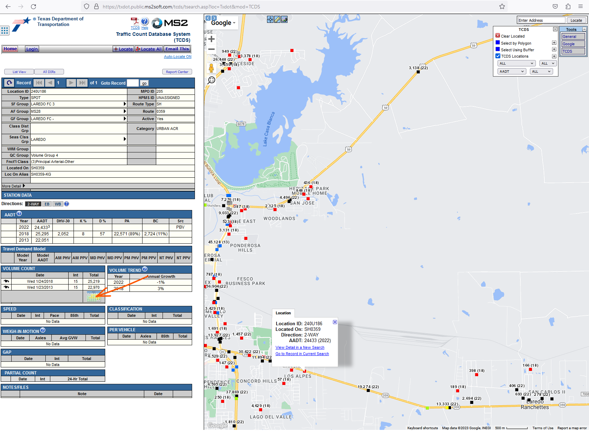{width=80%}
</center>
<br>

In the calendar frame, the URL is not changed, the next step is to right click inside the left frame of the webpage (where data is shown) and select This Frame > Open Frame in New Tab. 

<center>
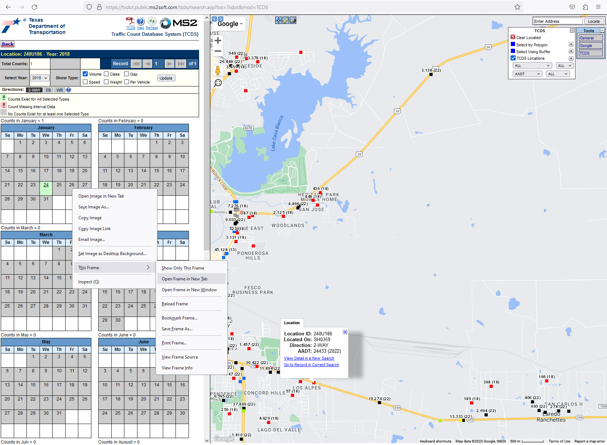{width=80%}
</center>
<br>

The new tab is opened as a single frame element and the URL should show the parameters needed. As a reminder, these steps are only needed if the platform to be used is not previously registered. Add the parameters "offset" and "a" to the input file parameters tab, along with the State they correspond to.

<center>
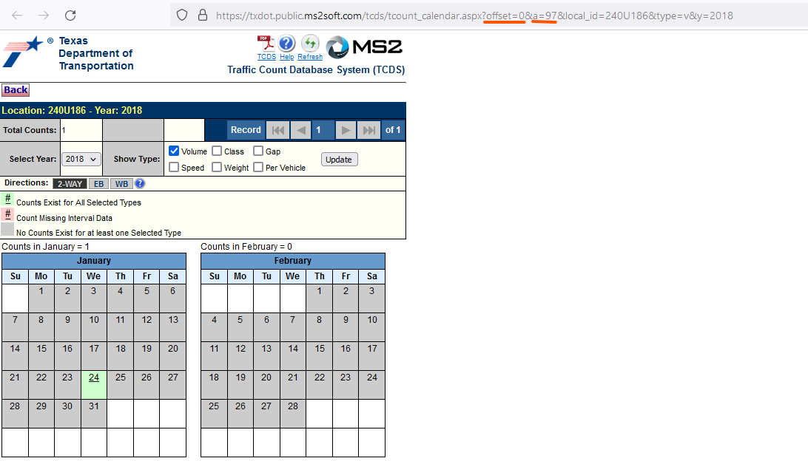{width=80%}
</center>
<br>

**3. Copy folders and prepare folder structure**

To prepare the program to run it is important to maintain the folder structure, this will allow for all functionality to behave as intended and to simplify file management, as well as avoiding the user to define working directories. To have a functional copy of the script, all folders and files should be copied into the desired directory (usually within the Existing Information folder of any project).
The base folder structure contains the inputs folder, which has both input files explained before; the outputs folder, which is used at the moment to contain the output database produced by the web scraping process. The outputs folder is designed so that users can save different databases produced within R, results and insights, the stations locations geographic file and graphs as needed. The R folder contains the main script used for data processing, usualy named as processing.R.
It is reccommended to create a new R project using a folder with this structure as the main directory so that all files, processes and scripts are contained within the same structure, the next figure shows a typical folder structure.

<center>
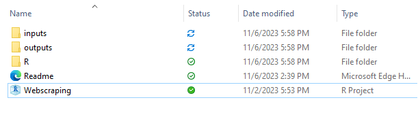
</center>
<br>

After running the code for the first time, an additional folder will be created named "Stations". This folder contains the raw files downloaded during the web scraping process sorted by the analysis types and years for the data that was obtained.

In addition to the directory structure within the R project, an additional step has to be performed into the system's downloads folder, to ensure the best functionality, empty the downloads folder (erase all files). This is important because as part of the program's functionality, it will save each file downloaded, copy it into the correct folder and then delete it from the downloads folder. In case there is an error and a file is not found, there is a risk that the program copies the previous file, and there might be duplicated data when consolidating all databases.
